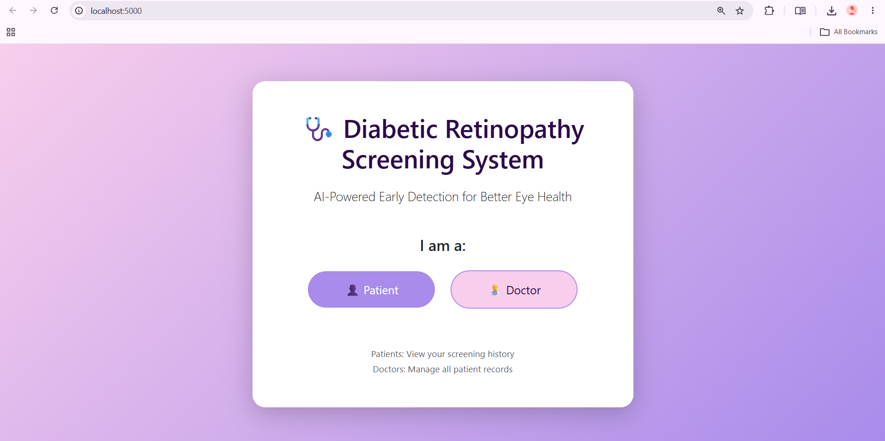
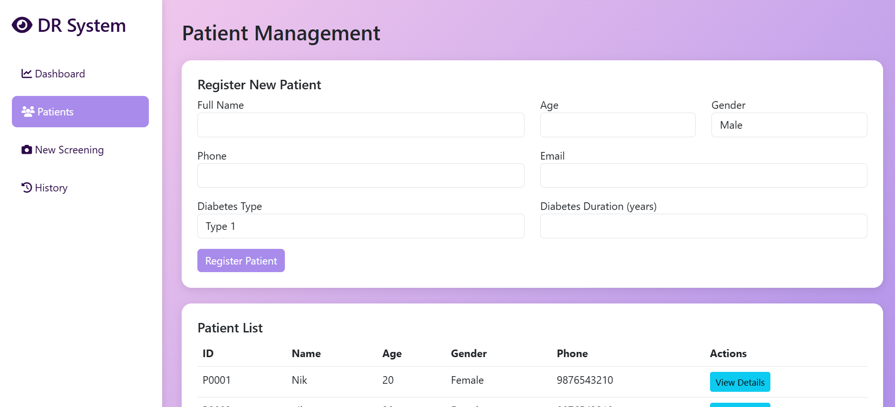

<table>
<tr>
<td align="center">

 <b>Landing Page</b>
</td>

<td align="center">

 <b>Doctor Login</b>
</td>
</tr>

<tr>
<td align="center">

 <b>Doctor Dashboard</b>
</td>

<td align="center">

 <b>Patient Management</b>
</td>
</tr>

<tr>
<td align="center">

 <b>New Screening</b>
</td>

<td align="center">

 <b>Patient Dashboard</b>
</td>
</tr>

<tr>
<td align="center">

 <b>Prediction Analysis</b>
</td>
<td></td>
</tr>
</table>
